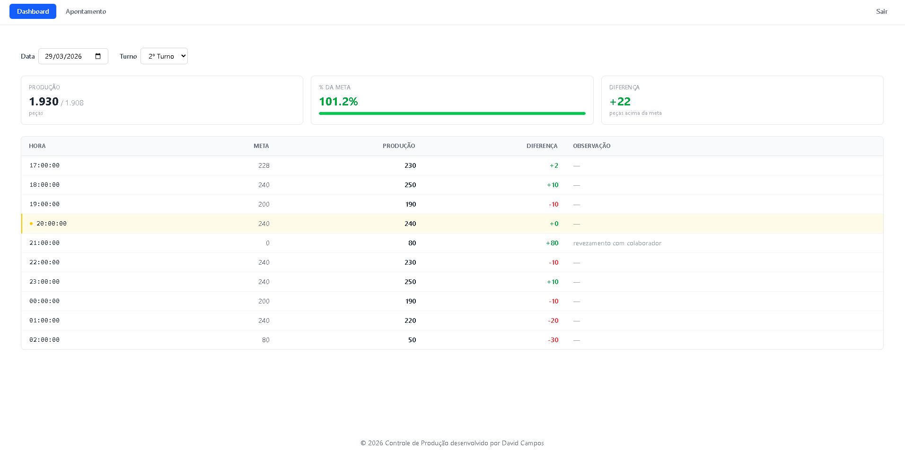

# 🏭 Painel de Produção

Dashboard web para acompanhamento em tempo real do progresso de turnos de produção industrial, integrado com API REST desenvolvida em Java Spring Boot.

> 🔗 **[Acesse o projeto ao vivo](https://painel-producao-mocha.vercel.app)** &nbsp;|&nbsp; 🔗 **[Backend (controle-producao)](https://github.com/davidCamposDev/controle-producao)**

---

## 📸 Preview

<!-- Substitua pelo caminho do seu print -->


---

## 🚀 Funcionalidades

- 📊 Visualização do progresso de produção por turno em tempo real
- 📋 Apontamento de produção por operador/máquina
- 📈 Indicadores de desempenho (meta x realizado)
- 🔄 Integração com API REST Java Spring Boot
- 📱 Interface responsiva com Tailwind CSS

---

## 🛠️ Tecnologias

**Frontend**


**Backend (repositório separado)**


**Deploy**


---

## 🏗️ Arquitetura

```
painel-producao (Frontend - React)
        │
        │  HTTP / REST API
        ▼
controle-producao (Backend - Java Spring Boot)
        │
        ▼
     Banco de Dados
```

---

## ⚙️ Como rodar localmente

### Pré-requisitos

- Node.js 18+
- Backend [controle-producao](https://github.com/davidCamposDev/controle-producao) rodando na porta `8080`

### Instalação

```bash
# Clone o repositório
git clone https://github.com/davidCamposDev/painel-producao.git

# Entre na pasta
cd painel-producao

# Instale as dependências
npm install
```

### Configuração

Crie um arquivo `.env` na raiz do projeto:

```env
VITE_API_URL=http://localhost:8080
```

### Executando

```bash
npm run dev
```

Acesse: [http://localhost:5173](http://localhost:5173)

## 👨‍💻 Autor

**David Campos**

[](https://linkedin.com/in/davidcamposdev)
[](https://github.com/davidCamposDev)
